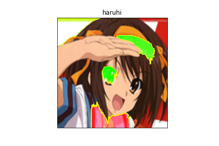

# アニメ画像のクラス分類と判断根拠の可視化  
データセット: [https://www.kaggle.com/splcher/animefacedataset](https://www.kaggle.com/splcher/animefacedataset)  
  
---    
  
実行結果:   
    
  
---

使い方:  
1. モデルのダウンロード: [https://drive.google.com/file/d/1-Cj2snDYK1PGoS0zgGFjRTwyPJGjoz6S/view?usp=sharing](https://drive.google.com/file/d/1-Cj2snDYK1PGoS0zgGFjRTwyPJGjoz6S/view?usp=sharing)  
ダウンロードしたモデルを`weights/`に配置する.  
2. コマンドの実行  
  
```
$ python predict img_path # 画像分類の推論結果
$ python gradcam img_path True(or False) # 大局説明の写真を保存する
```
